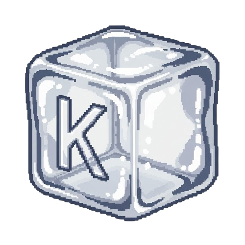

  

<h1 align="center">KoolStats</h1>

  minimal & cute fps + ping counter for gamers who want performance  
  ✨ simple • 🔥 clean • 🎀 lightweight • 🤌 slay both frames & lag

---

## 🧊 What is KoolStats?

KoolStats is a no-nonsense stats HUD that shows:

- ✅ FPS  
- ✅ Ping  
- ✅ *(Optional)* 1% Low FPS  

with **no graphs, no bloat, no lag**. Just pure stats, baby.

---

## 📦 Versions

| Version | FPS | Ping | 1% Low | Color Alerts        | Menu Options     |
|---------|-----|------|--------|----------------------|------------------|
| **Zero**   | ✅   | ✅    | ❌      | ❌                    | ❌                |
| **Lite**   | ✅   | ✅    | ❌      | 🔴 (only if FPS ≤ 10) | Lock Only         |
| **Normal** | ✅   | ✅    | ❌      | ✅                    | ✅                |
| **Pro**    | ✅   | ✅    | ✅      | ✅                    | ✅                |

---

## 🎮 Works With:

- Roblox  
- Minecraft  
- Valorant  
- Literally anything — even your aunt's laptop

---

## 🧼 Is It Safe?

YEAH. KoolStats is **100% clean**:  
- No viruses  
- No miners  
- No keyloggers  
- No background weirdness  
- No sus 🧍

Just open-source overlay magic.  
You can even read the code if you're paranoid 😌

---

## 🤔 Accuracy?

Look bro — it ain’t NASA level, but:

- **FPS** = calculated per frame  
- **Ping** = tested with google.com  
- **1% Low** = basic frame drop calc every 5 seconds  

If you want pixel-perfect benchmarking, go download MSI Afterburner 😤  
This one is for real gamers who just wanna know:  
> “am I lagging rn??”

---

## 🧃 Why KoolStats?

because:
- shift+F5 covers half your screen  
- roblox hides ping  
- overlays tank fps  
- you want a cute clean stat box, not a NASA dashboard

---

## 🖥 How to Use

1. Download the `.exe` from [Releases](#)
2. Run it
3. Right click the window for options (if supported)

✅ No install  
✅ No background process  
✅ No tray icon  
✅ Just vibes

---

## 🏷️ Licenses & Legal

This project is made by a 12 y/o who makes **$0.00** from it 😤  
You **can remix it**, but:

- DO NOT resell  
- DO NOT remove credit  
- If you use it, **credit Koolli** in title or somewhere clickable 🔗

📄 Custom License inside `LICENSE.txt`

---

## 🧠 Made by:

**Koolli** — just tryna stop lag from ruining friendships 🙃  
- 🎀 Instagram: [@koollify](https://instagram.com/koollify)  
- 🔥 TikTok: [@koolli](https://tiktok.com/@koolli)  
- 📺 YouTube: [@koolli](https://youtube.com/@koolli)

---

### 💌 Questions? DM Koolli on IG or open an Issue

> this readme slay both nerds & girlies  
> fps go up, stress go down 💅
